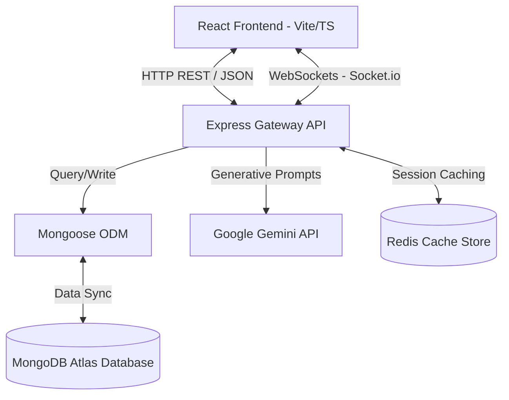
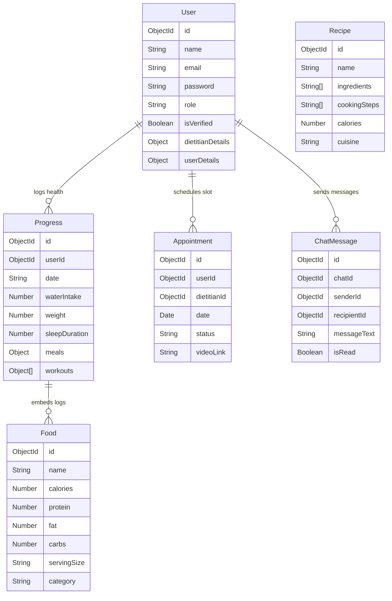
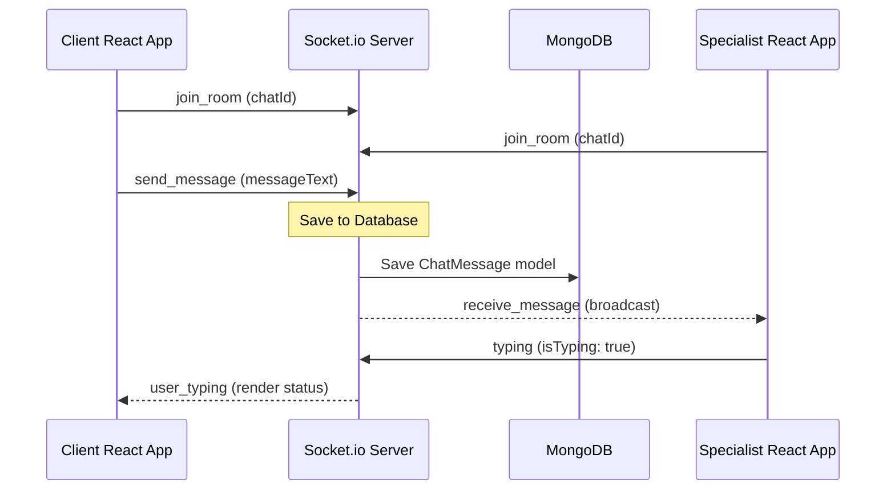

# System Architecture & Database Design - NutriMind AI

This document maps out the system diagrams, architectural data flows, and database schemas for the NutriMind AI Nutrition & Wellness platform.

---

## 1. System Architecture Diagram

The platform utilizes a structured MERN Stack architecture where client interactions occur over HTTP REST endpoints, while messaging operates on Socket.io tunnels.

---

## 2. Entity-Relationship (ER) Schema

---

## 3. Real-Time Chat Sequence Flow

This sequence models the messaging flows between users and dietitian specialists via Socket.IO.

