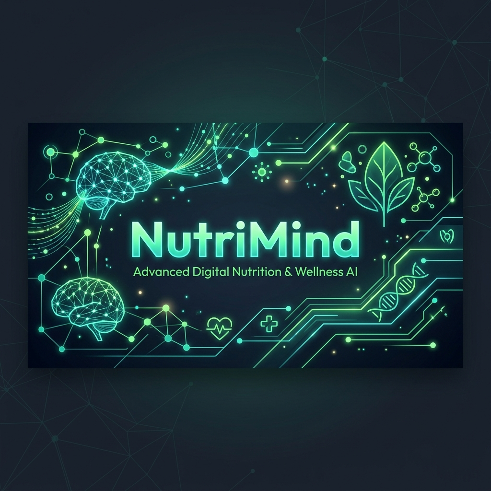
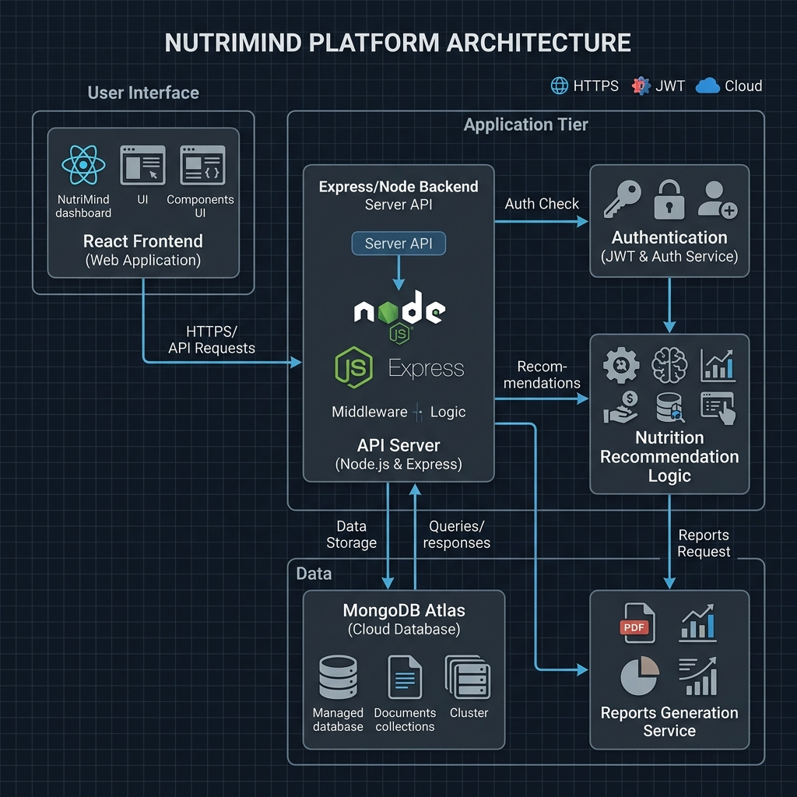

# NutriMind AI - Enterprise Nutrition & Wellness Platform



---

<div align="center">

[](https://github.com/jyothika2212/nutrimind/actions/workflows/build.yml)
[](https://nodejs.org/)
[](https://react.dev/)
[](https://www.typescriptlang.org/)
[](https://www.mongodb.com/atlas)
[](https://www.docker.com/)
[](LICENSE)

**NutriMind AI** is an enterprise-grade wellness platform designed to bridge the gap between AI-driven diet optimization and professional nutritionist support. It provides individuals with the tools to log, track, and optimize their daily nutrition, workouts, and wellness habits.

[Explore Features](docs/highlights.md) • [API Contract](docs/API.md) • [Deployment Guides](docs/deployment.md) • [Report Issues](SECURITY.md)

</div>

---

## 1. Project Description
Maintaining a balanced diet and regular exercise is difficult in today's fast-paced world. Individuals often face **Information Overload** from conflicting advice, a **Lack of Personalization** in generic meal charts, and a **Separation of Automation & Guidance** where AI chatbots lack personal touch and human dietitians lack continuous visibility into clients' daily habits.

NutriMind AI resolves these friction points by combining **Generative AI** with an interactive **Dietitian Workspace**:
* **Smart Intake Analyzers:** Parses natural text logs to automatically extract and register food ingredients and macronutrient values.
* **Personalized AI Engines:** Evaluates user goals (weight loss, muscle gain, maintenance) to compute daily calorie quotas and weekly meal calendars.
* **Integrated Health Calendars:** Connects clients with real dietitians for chat consultations and video appointments.
* **Specialist Worksheets:** Enables dietitians to monitor their clients' logs in real-time and assign customized daily dietary programs.

---

## 2. Key Features

* **Interactive Health Dashboard:** Live charts tracking calories, water, sleep, weight, and workouts over time.
* **AI Recipe Constructor:** Generates custom step-by-step recipes on demand from ingredients listed in the user's pantry.
* **AI Nutritionist Agent:** Answers wellness queries and analyzes meal logs in natural language.
* **Real-time Messaging:** WebSockets-based chat rooms for instant communication between clients and assigned dietitians.
* **Video Consulting Scheduler:** Integrated calendar for scheduling and approving video calls with dietitians.
* **Admin Control Center:** System statistics overview and role permissions management tools.

---

## 3. Technology Stack

| Tier | Technology | Description |
| :--- | :--- | :--- |
| **Frontend** | React 19, TypeScript, Vite, Tailwind CSS, Redux Toolkit, Recharts | Glassmorphism dashboard styled UI featuring animated components and interactive charts. |
| **Backend** | Node.js, Express, TypeScript, Socket.io | MVC-pattern API server providing JWT authentication and persistent WebSocket channels. |
| **Database** | MongoDB Atlas, Mongoose ODM | Document database for storing accounts, logs, recipes, and appointments schemas. |
| **AI Layer** | Google Gemini API | Natural language parsing and weekly meal plan generation. |

---

## 4. Project Architecture

NutriMind AI is built as a decoupled Client-Server architecture utilizing HTTP REST API contracts for configuration/data operations and WebSockets for real-time channels:



*For database ER diagrams and Socket sequences, see [docs/architecture.md](docs/architecture.md).*

---

## 5. Model Information
The core recommendation intelligence is powered by **Google Gemini AI** (`gemini-2.5-flash`) via the official `@google/generative-ai` SDK.
* **Role Simulation:** Programmed with system instructions instructing the model to act as an elite clinical dietitian.
* **Intelligent JSON Schema Mapping:** Prompts request strict JSON responses, enabling the backend to seamlessly parse nutritional allocations, ingredients lists, and recipes.
* **Unstructured Log Processing:** Uses zero-shot learning to estimate portion sizes, calories, and macronutrient values from natural language user logs (e.g., *"I had a small bowl of brown rice and grilled salmon"*).

---

## 6. Project Workflow

```text
[User registers & sets goals]
            │
            ▼
[Profile data saved to MongoDB]
            │
            ▼
[User requests AI Recommendation] ──► [Backend builds prompt with user bio-data]
            │                                             │
            │                                             ▼
            │                              [Gemini AI returns nutrition targets]
            │                                             │
            ▼                                             ▼
[Calorie & Macro goals set] ◄────────────── [Goals updated in MongoDB user profile]
            │
            ├──► [User logs meals, water, and workouts daily]
            │
            └──► [User assigns Dietitian and requests Video Consulting slot]
                        │
                        ▼
            [Dietitian logs in to workspace]
                        │
                        ▼
            [Reviews Client charts and logs]
                        │
                        ▼
            [Creates & assigns customized Meal Plans]
                        │
                        ▼
            [Communicates in real-time via Socket.IO]
```

---

## 7. Folder Structure

Below is an abbreviated overview of the repository structure. For the complete, annotated file tree, refer to [Project Structure](docs/project_structure.md).

```text
nutrimind/
├── .github/
│   ├── ISSUE_TEMPLATE/  # Github issue templates
│   └── workflows/       # CI Build Verification workflows
├── docs/                # Developer guides and system assets
│   └── screenshots/     # Application screenshots checklists
├── backend/             # Express API server (TypeScript)
│   ├── src/controllers/ # Request handlers
│   ├── src/models/      # Database schemas (Mongoose)
│   └── src/routes/      # Endpoint mapping
└── frontend/            # React Client SPA (Vite/TS)
    ├── src/components/  # Layout structures and route guards
    └── src/pages/       # Page components (Admin, Client, AI)
```

---

## 8. Installation & Setup

### Prerequisites
* **Node.js** (v18 or higher)
* **MongoDB** (Local instance or MongoDB Atlas account)

### Local Configuration

1. Create a `.env` file in the `backend/` directory:
   ```env
   PORT=5000
   MONGODB_URI=mongodb://localhost:27017/nutrimind
   JWT_SECRET=your_jwt_secret
   JWT_REFRESH_SECRET=your_jwt_refresh_secret
   GEMINI_API_KEY=your_google_gemini_api_key
   ```
2. Create a `.env` file in the `frontend/` directory:
   ```env
   VITE_API_BASE_URL=http://localhost:5000
   ```

### Execution Commands

1. **Boot the Backend:**
   ```bash
   cd backend
   npm install
   npm run seed  # Seeds default test profiles
   npm run dev
   ```
2. **Boot the Frontend:**
   ```bash
   cd frontend
   npm install
   npm run dev
   ```
   *Visit the app at `http://localhost:3000`.*

### Multi-Container Docker Setup
Run the entire platform (Frontend, Backend) with a single command from the repository root:
```bash
docker-compose up --build
```

---

## 9. Usage Guide

### Seed Credentials
To explore the platform dashboard interfaces immediately, log in using these pre-seeded profiles:

* **Administrator Workspace:**
  * **Email:** `admin@nutrimind.ai`
  * **Password:** `nutri123`
* **Dietitian Specialist Workspace:**
  * **Email:** `sarah@nutrimind.ai`
  * **Password:** `nutri123`
* **Client Portal:**
  * **Email:** `manoj@example.com`
  * **Password:** `nutri123`

---

## 10. Deployment

Detailed cloud installation steps are documented in [docs/deployment.md](docs/deployment.md).
* **Backend:** Deploy the `backend/` directory on [Render](https://render.com) as a Web Service.
* **Frontend:** Deploy the `frontend/` directory on [Vercel](https://vercel.com) as a React Vite SPA.

---

## 11. Screenshots Checklist
Below is a checklist of required screenshots to represent all sections of the application once they are captured by the administrator post-deployment:

- [ ] **Home / Landing Page:** Introduction, portal login portals.
- [ ] **Login View:** Glassmorphism form for user credentials.
- [ ] **Registration View:** Form to choose role (Client, Dietitian, Nutritionist).
- [ ] **Client Dashboard:** Visual health metrics, weight tracker graphs, calorie indicators.
- [ ] **AI Assistant:** Gemini chatbot pane for health consultations.
- [ ] **Meal Planner:** Dietitian workspace with recipe grids.
- [ ] **Reports View:** Detailed graphs representing calorie history logs.
- [ ] **Profile Manager:** Forms to configure age, weight, goals, and allergies.
- [ ] **Admin Dashboard:** Platform stats cards, user tables list, and roles update forms.

---

## 12. Demo Video
*A walk-through video demonstrating features (registration, logging, AI recipes, and specialist assignments) can be recorded and referenced here:*

* **Video Walkthrough File:** `docs/screenshots/demo.mp4` (Not currently recorded; developers can record a walk-through and place it at this location).

---

## 13. Future Enhancements
* **Wearable Integrations:** Connect with Apple HealthKit and Google Fit APIs to sync workouts and vitals.
* **Custom Meal Scanning:** Implement image classification models so users can take photos of meals to estimate calories.
* **Offline Synchronization:** Utilize service workers to support meal logs buffering during network disruptions.

---

## 14. Contributors & License

### Contributors
* **Jyothika** (Project Creator) - [GitHub profile](https://github.com/jyothika2212)

### License
This project is licensed under the MIT License - see the [LICENSE](LICENSE) file for details.
