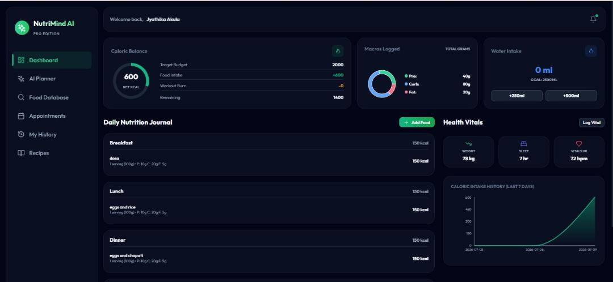
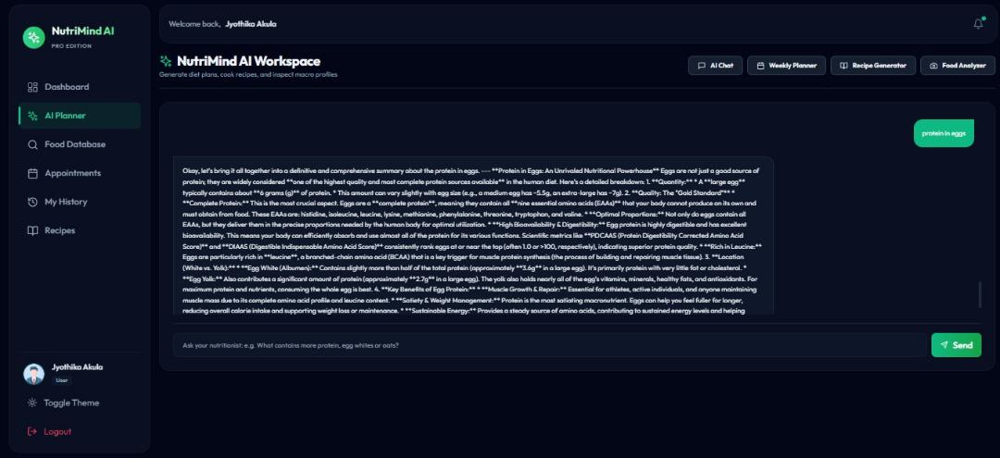
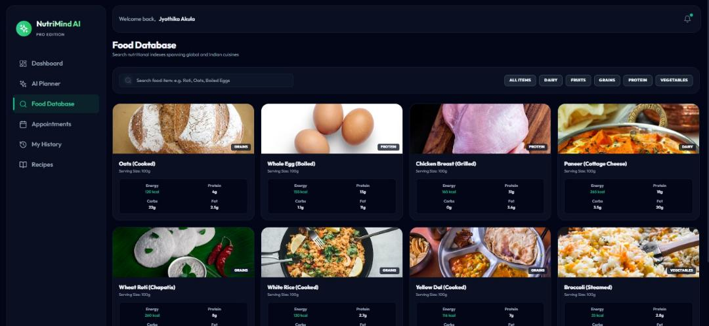
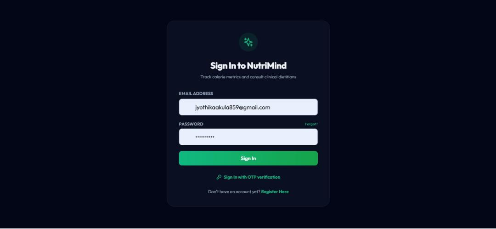
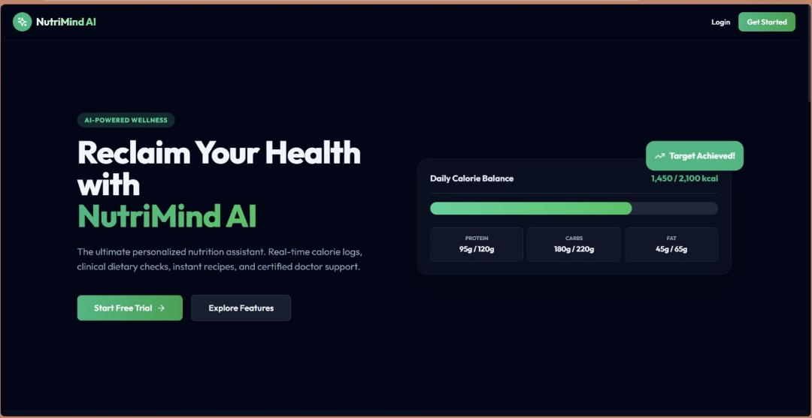
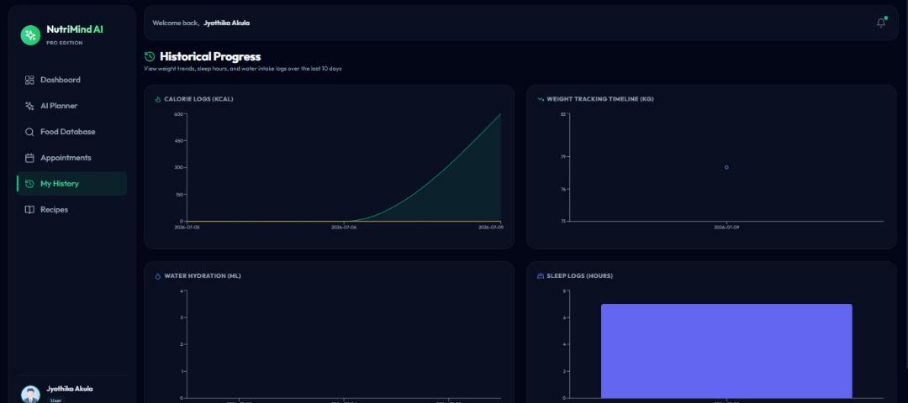

# NutriMind AI - Screenshots Guide

This directory houses the graphical screens representing the client portal, AI integrations, database search tools, and progress logs of the active application.

---

## Screenshot Status Overview

* [x] **Client Dashboard:** `client_dashboard.jpg`
* [x] **AI Nutrition Chat:** `ai_nutrition_chat.jpg`
* [x] **Food Database:** `food_database.jpg`
* [x] **Appointment Scheduler:** `appointment_scheduler.jpg`
* [x] **Consultation Success:** `consultation_success.jpg`
* [x] **Progress Tracking:** `progress_tracking.jpg`
* [ ] **Home Page:** *Missing*
* [ ] **Login Page:** *Missing*
* [ ] **Registration Page:** *Missing*
* [ ] **Dietitian Dashboard:** *Missing*
* [ ] **Video Consultation:** *Missing*
* [ ] **Admin Dashboard:** *Missing*

---

## Available Screenshots

### 1. Client Dashboard

*The main health metrics panel showing daily calorie budgeting, log summaries, sleep history, and water intake stats.*

### 2. AI Nutrition Chat

*Generative nutrition planner displaying natural language chat history with the Gemini AI engine.*

### 3. Food Database

*Global search logs catalog for individual food items, showing portion measures, energy, carbs, protein, and fat allocations.*

### 4. Appointment Scheduler

*Client workspace form for selecting dietitian specialists, logging date slots, and verifying scheduled sessions.*

### 5. Consultation Success

*Database success verification popup after reserving video slots on Vercel.*

### 6. Progress Tracking

*10-day timeline charts displaying weight curves, sleep logs, water metrics, and calorie budget histories.*

---

## 🎥 Project Demo Video

A full platform walkthrough video is available in the repository:
* **File Location:** [assets/demo.mp4](../../assets/demo.mp4)
* **Direct Download link:** [Download demo.mp4](../../assets/demo.mp4?raw=true)

---

## Missing Screens Checklist
The following screens still need to be captured and placed in this directory:
- [ ] **Home Page:** Application landing and overview sections.
- [ ] **Login Page:** Sign-in screen featuring email/password inputs.
- [ ] **Registration Page:** Sign-up portal to create Client, Dietitian, or Admin sessions.
- [ ] **Dietitian Dashboard:** Specialist control panel to examine client timelines and assign diet plans.
- [ ] **Video Consultation:** Secure WebRTC videolink conference view (powered by Jitsi Meet).
- [ ] **Admin Dashboard:** Platform stats charts and role permissions settings forms.
